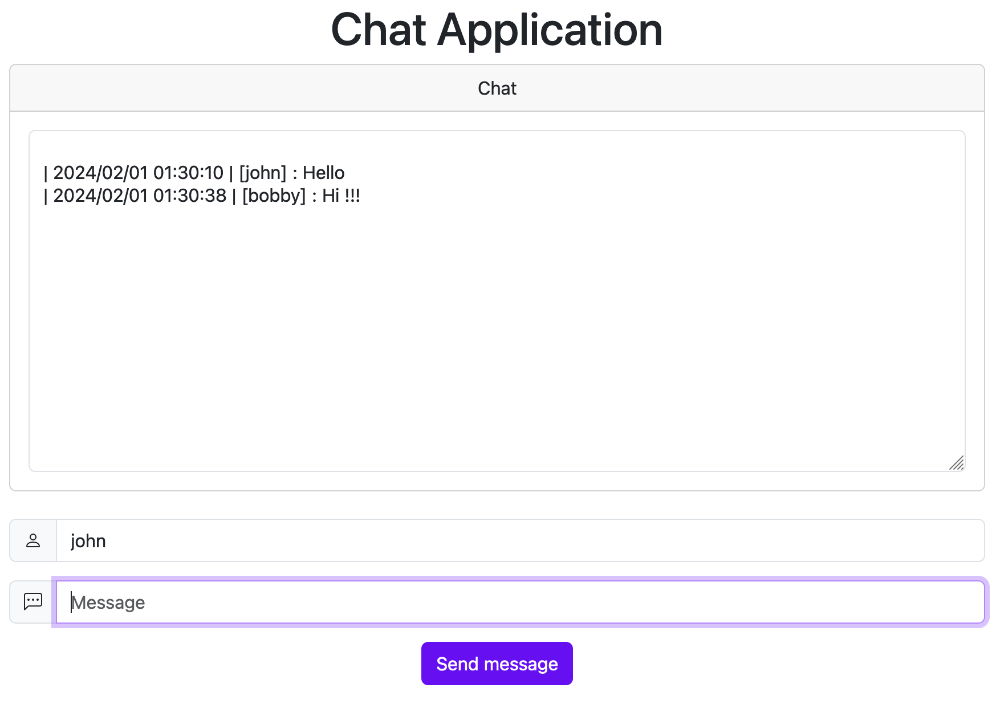

# poc-go-svelte-websockets

## Why

poc-go-svelte-websockets is a proof of concept using websockets with a Go backend and a Svelte/Typescript frontend.

## Dependencies

* Go >= 1.21
* NPM (latest versions)
* make

## Quick Start

```
make build
./poc-go-svelte-websockets
```
Then, go to `http://localhost:9000`.

## Screen



## Usage

```
❯ ./poc-go-svelte-websockets -h
Usage of ./poc-go-svelte-websockets:
  -cors
        enable CORS for dev
  -port string
        change :port or ip:port (default ":9000")
  -version
        print poc-go-svelte-websockets version
```

## Notes

* Thanks to https://programmingpercy.tech/blog/mastering-websockets-with-go/ for backend logic
* Websocket module : `github.com/gorilla/websocket`
* WebUI CSS : Bootstrap 5